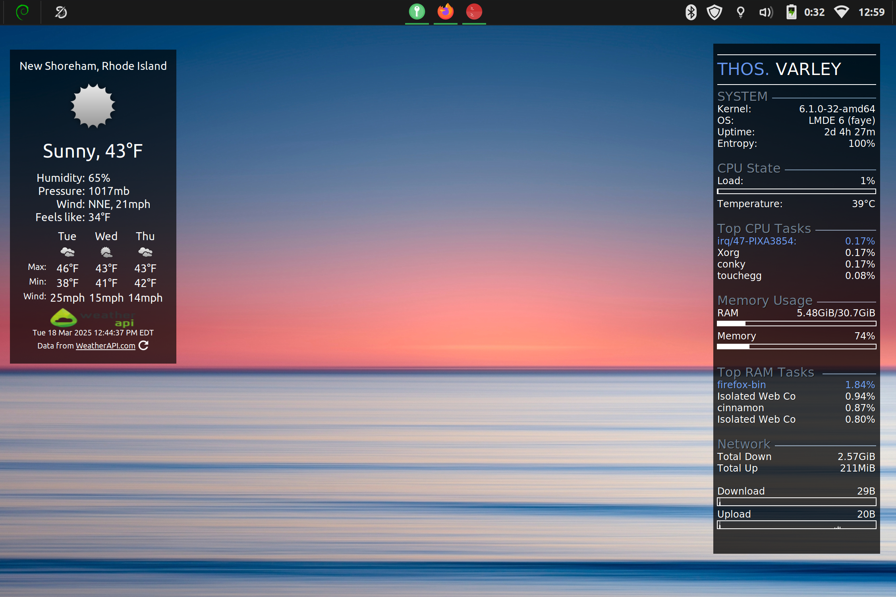

# Modular conky sidebar
A modular conky sidebar for keeping an eye on system behavior. 

Each piece of the sidebar is defined in its own configuration file in the `configs` directory. You can change the order in the `buildconky.sh` script.

To compile a new master `conky.conf`, run `./buildconky,sh`. To start it, run ``./startconky.sh``.

### Setting network address

To use the ``network.conky`` module, you will need to hardcode in your own network address. You can find this by running ``iwgetid | awk '{print $1}'`` in your terminal, and substituting in the output into the relevant network.conky (where you see ID). 

## Image
Here's a photo my desktop so you can see what it looks like in-context.

 
