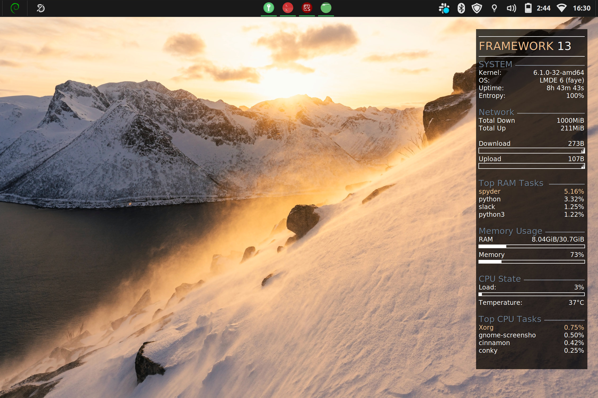

### Modular construction

Each piece of the sidebar is defined in its own configuration file in the `templates` directory. You can change the order in the `buildconky.py` script.

To compile a new master `conky.conf`, run `python buildconky.py`. To start it, run ``./startconky``.

### Defining global variables

One of the things that drove me most nuts about Conky was that you can't actually define a variable as reference it later in the conky.conf file itself. So I wrote a Python wrapper that builds a new conky.conf for you from templates. Thanks to the magic of formatting strings in Python, you can define global variables that get written directly to the output.

Currently available options in the ``buildconky.py`` file are: the primary highlight color and the header color (which can be set automatically, see below), the headline name (Framework 13 in the below images), and the network address. Define those variables in the build file, and during compilation they will be written right into the ``conky.conf``.

### Automatic desktop theming
This Conky can also sync its color scheme directly to your Desktop background. Currently its written assuming you're in a Cinnamon Desktop Environment (because that's what I'm using), but if you've read this far, you're probably the kind of person up to the challenge of configuring it for your own system. You just need to find the config file for your desktop. On Cinnamon the command is:

"""
gsettings get org.cinnamon.desktop.background picture-uri
"""

``gsettings`` should work for any major Linux distro. If you're on Windows, you're on your own.

The automatic desktop theme works by loading in your Desktop background, and using K-means clustering to find major color features of the image, and then selects the most luminous one (for a brighter theme).

Every time you call ``python buildconky.py``, it will pull your Desktop and do the color matching.

## Install
The ``buildconky.py`` and ``runconky.sh`` assume that conky is running out of the ``~/.conky/`` directory. Clone this repo, and unpack everything in that directory and it should all work out of the box. If you just run ``./startconky.sh`` without first configuring and building a desired layout, it will automatically build the layout you see in the image below.

### Dependencies
The basic modular Conky setup can be done with a base Python install. To use the color picker options in ``colorlib.py``, you need to have Numpy and Scikit-Learn (for K-means clustering).

### Setting network address

To use the ``network.conky`` module, you will need to set the ``network_address`` variable in the build file. You can find this by running ``iwgetid | awk '{print $1}'`` in your terminal.

## Images
Some screengrabs of my desktop with different backgrounds to show off the automated color matching - note that different order of the modules.

